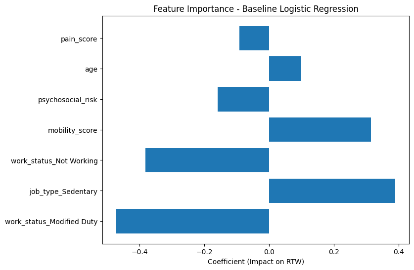
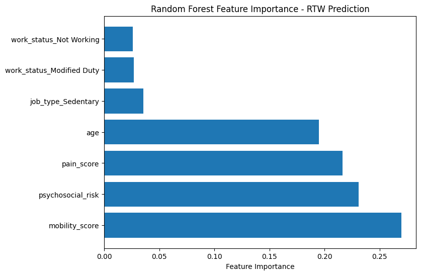

# Return-to-Work (RTW) Prediction Using Machine Learning  

This project applies machine learning models to predict **Return-to-Work (RTW)** outcomes following low back pain rehabilitation. The goal is to evaluate model performance under class imbalance and assess how different algorithms perform in identifying patients who successfully return to work.

This project was completed using a **synthetic clinical dataset**.

---

## Project Overview

- **Problem Type:** Binary Classification  
- **Target Variable:** Return to Work (RTW: 1 = Yes, 0 = No)  
- **Models Used:**
  - Baseline Logistic Regression (Unbalanced)
  - Balanced Logistic Regression
  - Balanced Random Forest Classifier  
- **Primary Challenge:** Class imbalance in RTW outcomes  

---

## Dataset

- The dataset used in this project is **synthetically generated**
- No real patient data was used
- The dataset simulates:
  - Pain intensity
  - Psychosocial risk
  - Mobility
  - Age
  - Work status
  - Job type
  - Modified duties

Location of dataset: data/low_back_pain_rtw_dataset.csv

---

## Methods

### Models Implemented

- Logistic Regression (Baseline)
- Logistic Regression (Balanced)
- Random Forest Classifier (Balanced)

### Preprocessing

- Feature encoding
- Train-test split
- Class balancing
- Model evaluation using:
  - Accuracy
  - Precision (RTW)
  - Recall (RTW)
  - F1-score (RTW)
  - Confusion Matrix

---

## Model Performance Comparison

| Metric | Logistic Regression (Baseline) | Logistic Regression (Balanced) | Random Forest (Balanced) |
|--------|--------------------------------|--------------------------------|---------------------------|
| Test Accuracy | 0.61 | 0.59 | 0.76 |
| Recall (RTW) | 0.04 | 0.59 | 0.04 |
| Precision (RTW) | 0.33 | 0.30 | 0.33 |
| F1-score (RTW) | 0.08 | 0.40 | 0.08 |

---

## Key Findings

- The **baseline Logistic Regression** achieved moderate accuracy but performed very poorly at identifying successful RTW cases.
- The **balanced Logistic Regression** significantly improved recall for RTW patients, making it more clinically useful despite slightly lower overall accuracy.
- The **Random Forest model** achieved the highest overall accuracy but failed to capture the minority RTW class effectively.
- Across models, the most influential features included:
  - Pain intensity  
  - Psychosocial risk  
  - Mobility  
  - Job demands  
  - Work status  

These findings align with established rehabilitation and return-to-work principles[^1].

---

#### Feature Importance Plots

Below are the feature importance plots generated from each model:

### Baseline Logistic Regression

### Balanced Logistic Regression

### Random Forest

---

## Conclusion

In this project, baseline and balanced Logistic Regression models, along with a Random Forest classifier, were applied to predict return-to-work outcomes following low back pain rehabilitation. The baseline Logistic Regression achieved moderate overall accuracy but struggled to identify patients who actually returned to work, while balancing for class imbalance improved sensitivity at the cost of overall accuracy. The Random Forest model achieved the highest overall accuracy but underperformed in detecting the minority return-to-work cases, highlighting the trade-off between predictive performance and clinical utility. Across all models, pain intensity, psychosocial risk, mobility, and work-related factors consistently emerged as the most important predictors, aligning with established rehabilitation principles. These results demonstrate the potential of machine learning to support rehabilitation decision-making while emphasizing the importance of model selection, class imbalance handling, and clinical interpretability.

---

## Project Structure

low_back_pain_rtw_prediction_project/
│
├── data/
│   └── low_back_pain_rtw_dataset.csv
│
├── notebooks/
│   └── Return_to_Work_Modeling.ipynb
│
├── images/
│   ├── baseline_logistic_regression_feature_importance.png
│   ├── balanced_logistic_regression_feature_importance.png
│   └── random_forest_feature_importance.png
│
├── environment.yml
│
└── README.md

---

## Tools & Libraries Used

- Python  
- NumPy  
- Pandas  
- Scikit-learn  
- Matplotlib  
- Seaborn  
- Jupyter Notebook  

---

## Ethical Statement

This project uses **only synthetic data**. No real patient records, personal identifiers, or protected health information were used.

---

## Author

**Amir Bagheri**  

---

## References

[^1]: Moura, D. S., et al. (2024). *Prognostic factors for return to work in patients affected by chronic low back pain: a systematic review.* [SpringerLink, Open Access](https://link.springer.com/article/10.1007/s12306-024-00828-y)